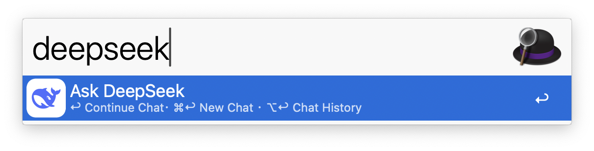
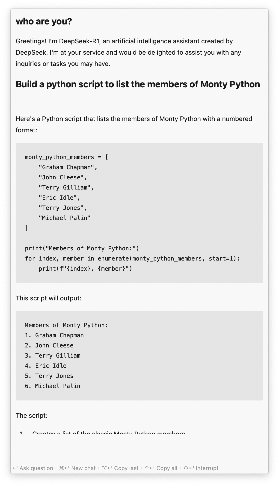
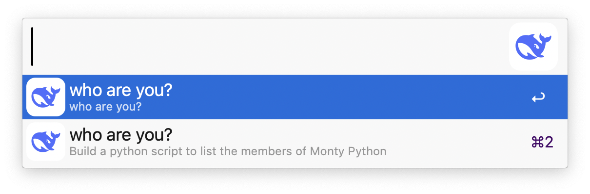

# AlfredWorkflow-DeepSeek

[简体中文 ReadMe](./readme.zh.md)

DeepSeek Alfred Workflow. Inspired from [Alfred Team ChatGPT / DALL-E workflow](https://alfred.app/workflows/alfredapp/openai/).

## Setup

1. Create an DeepSeek account and [log in](https://platform.deepseek.com/).
2. On the [API keys page](https://platform.deepseek.com/api_keys), click `+ Create new secret key`.
3. Name your new secret key and click `Create secret key`.
4. Copy your secret key and add it to the [Workflow’s Configuration](https://www.alfredapp.com/help/workflows/user-configuration/).

Note: If you are using [Tencent Cloud Wrap API](https://cloud.tencent.com/document/product/1772/115969). Please select the correct model.

## Usage

### DeekSeek

Query DeekSeek via the `deepseek` keyword, the [Universal Action](https://www.alfredapp.com/help/features/universal-actions/), or the [Fallback Search](https://www.alfredapp.com/help/features/default-results/fallback-searches/).

 

* <kbd>↩</kbd> Ask a new question.
* <kbd>⌘</kbd><kbd>↩</kbd> Clear and start new chat.
* <kbd>⌥</kbd><kbd>↩</kbd> Copy last answer.
* <kbd>⌃</kbd><kbd>↩</kbd> Copy full chat.
* <kbd>⇧</kbd><kbd>↩</kbd> Stop generating answer.

#### Chat History

View Chat History with ⌥↩ in the `chatgpt` keyword. Each result shows the first question as the title and the last as the subtitle.

<kbd>↩</kbd> to archive the current chat and load the selected one. Older chats can be trashed with the `Delete` [Universal Action](https://www.alfredapp.com/help/features/universal-actions/). Select multiple chats with the [File Buffer](https://www.alfredapp.com/help/features/file-search/#file-buffer).