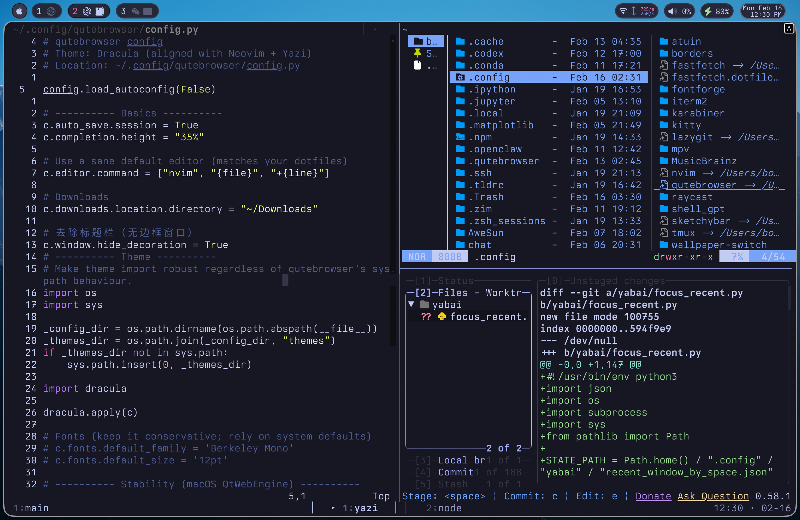
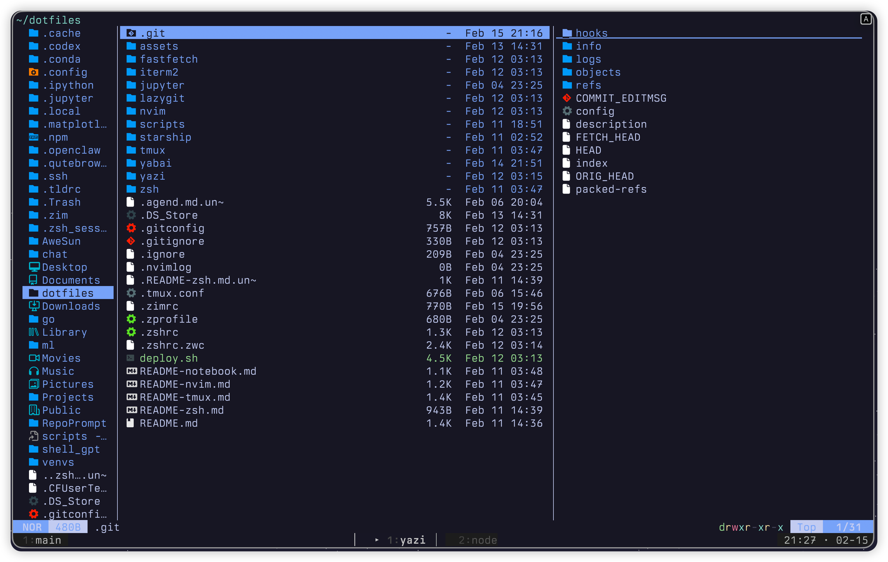
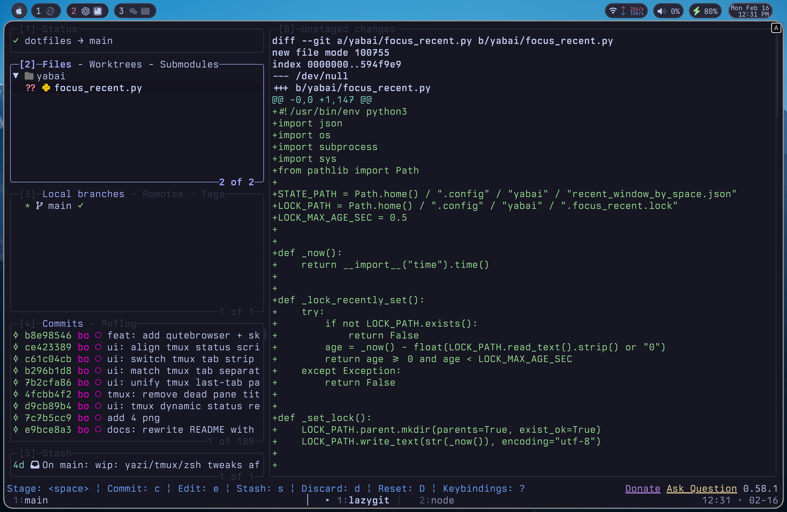

# Dotfiles (macOS)

Keyboard-first, low-noise terminal workflow built around **tmux + Neovim + Yazi + Lazygit**.

- **Terminal**: iTerm2 · Catppuccin Mocha · Berkeley Mono v2 (primary) · Maple Mono (Nerd Font)
- **Shell**: zsh + zimfw
- **WM**: yabai + borders (JankyBorders)

## Screenshots (privacy note)

The screenshots under `assets/` are intended to be **sanitized** (no personal info), but you should still review them before publishing (user/host, IPs, file paths, email, etc. can easily slip in).

### Terminal


### Split (nvim + yazi + lazygit)



### Yazi + Lazygit

<table>
  <tr>
    <td width="50%"><strong>Yazi</strong></td>
    <td width="50%"><strong>Lazygit</strong></td>
  </tr>
  <tr>
    <td></td>
    <td></td>
  </tr>
</table>

## What’s inside

- **tmux**: modular config + calm status bar + hardened scripts (clipboard, session manager, fzf panes)
- **Neovim**: lazy.nvim + LSP + formatting (conform/none-ls)
- **zsh (zimfw)**: modular loader + prompt + completions
- **yabai**: tiling config + focus border via `borders`
- **yazi**: Dracula Pro flavor + small theme overrides
- **lazygit**: config synced via deploy

## Repo layout

```
.
├── README.md
├── README-nvim.md
├── README-tmux.md
├── README-zsh.md
├── assets/
├── deploy.sh
├── iterm2/
├── lazygit/
├── nvim/
├── qutebrowser/
├── sketchybar/
├── tmux/
├── yabai/
├── yazi/
└── zsh/
```

## Deploy

```bash
git clone <repo> ~/dotfiles
cd ~/dotfiles
./deploy.sh
```

This script creates symlinks into:
- `~/.config/*`
- `~/.zshrc`, `~/.zimrc`, `~/.tmux.conf`, etc.

## Component docs

- Neovim → **README-nvim.md**
- tmux → **README-tmux.md**
- zsh → **README-zsh.md**
- qutebrowser → `~/.config/qutebrowser/` (symlinked)
- sketchybar → `~/.config/sketchybar/` (symlinked)

## Quick reloads

- tmux: `tmux source-file ~/.tmux.conf`
- nvim: `nvim --headless "+quit"`
- zsh: `exec zsh`
